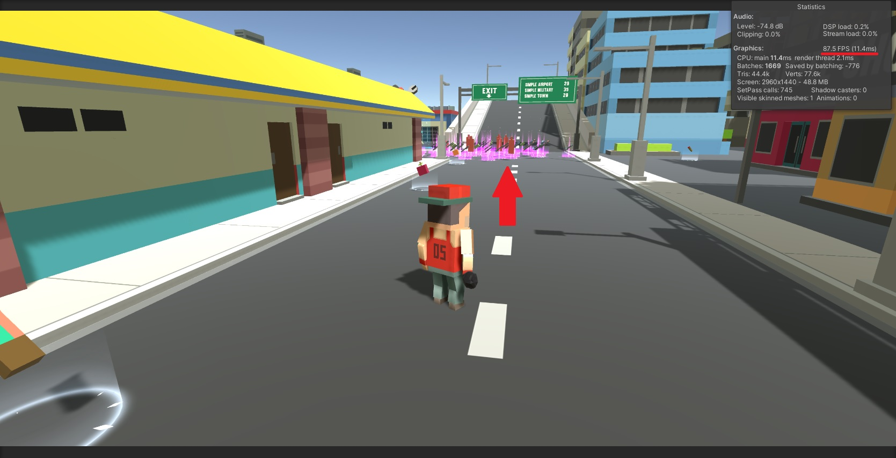
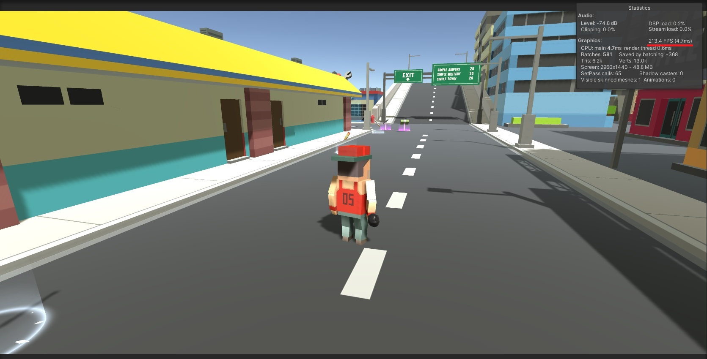

# DeactivateObjectsByDistance

### Why use this?
- In some cases you might have big scenes and a lot going on.
- For example having a big level with collectables and power ups.
- Those objects might contain particle effects and some other graphics effects.
- And at a certain distance might not be worth it to keep them rendering and using GPU.
- So just let them be visible at certain distance from the player.
- This is a very easy approach to solve this problem.

### How to use:

- Attach this to an object that has child with graphics and effects!
- The object with this script will be used to reference distance to target (player).
- Reference these objects in <em>objects</em> array.
- Reference the Transform target (Probably your player avatar in scene).
- Choose a distance that you want your objects to deactivate.
- There you go :D

 

### Performance test:

#### Not Using:

#### Performance Stats:
<strong> - FPS: </strong> 87.5 FPS
<strong>, CPU Time: </strong> 11.4 ms
<strong>, GPU Time: </strong> 2.1 ms
<strong>, Batches: </strong> 1669
<strong>, Tris: </strong> 44.4k
<strong>, Verts: </strong> 77.6k

#### Using this method:

#### Performance Stats:
<strong> - FPS: </strong> 213.4 FPS
<strong>, CPU Time: </strong> 4.7 ms
<strong>, GPU Time: </strong> 0.6 ms
<strong>, Batches: </strong> 581
<strong>, Tris: </strong> 6.2k
<strong>, Verts: </strong> 13.0k

#### Conclusion:
- Even though it's early on developing this game, it shows pretty interesting results. Got great performance boost and less load on CPU and GPU, this should scale well on lower end devices.
- <strong> Note: </strong> The power ups are still there, just the graphics and particle FX are being disabled on collectables all over the map. And as soon as you get closer they start to pop in. You can even add some animations to make it more seamless.
- <strong> Note 2: </strong> This is different than Unity culling system, as that system can only be used in static objects. This does not need objects to be static and uses distance rather than visible by camera to enable/disable objects. But it's still the same principle. (Same same, but diffeeeeeerent. But sill same! xD)

#### Performance Improvements (%):
<strong> - FPS: </strong> (+) 143.8%  
<strong> - CPU Time: </strong> (-) 142.8%  
<strong> - GPU Time: </strong> (-) 450%  
<strong> - Batches: </strong> (-) 387.2%  
<strong> - Tris: </strong> (-) 816.1%  
<strong> - Verts: </strong> (-) 696.9%  

